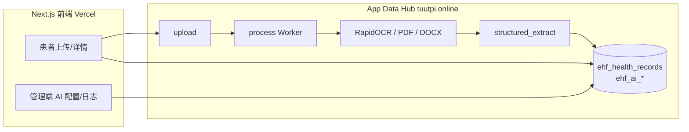

# EHF 患者数据钱包 · 开发进度与问题现状

> **文档类型**：阶段快照（进度 + 已知问题）  
> **更新日期**：2026-05-22  
> **代码仓库**：`myhealthdata-platform`（Next.js 前端）  
> **生产入口**：`https://app.myhealthdata.foundation`  
> **数据与 AI 服务**：App Data Hub `https://tuutpi.online`（`/v1/ehf/...`）

本文档描述**当前阶段**整体进度、各模块完成度，以及**正在发生 / 已用前端兜底**的问题。接口细节仍以 [`apidoc/EHF_API_REFERENCE.md`](apidoc/EHF_API_REFERENCE.md) 为准；AI 管线以 [`apidoc/EHF_OCR_DOCUMENT_PIPELINE_IMPLEMENTATION_NOTE.md`](apidoc/EHF_OCR_DOCUMENT_PIPELINE_IMPLEMENTATION_NOTE.md) 与 [`apidoc/EHF_AI_PROCESSING_BACKEND_REQUIREMENTS.md`](apidoc/EHF_AI_PROCESSING_BACKEND_REQUIREMENTS.md) 为准。

---

## 一、阶段结论（Executive Summary）

| 维度 | 状态 |
|------|------|
| **产品形态** | 三端 Web（患者 / 研究者 / 管理）POC，已接真实后端，弃用 Supabase 主路径 |
| **认证与档案** | 登录、注册、上传、列表、详情、授权、管理端列表等 **已打通** |
| **文档 OCR** | **已在数据服务器**完成（RapidOCR + PDF/DOCX 提取），非浏览器 OCR |
| **AI 结构化** | **已在服务器**调用管理端配置的 LLM（`structured_extract`）；DeepSeek 等需正确 `base_url` / `model_name` |
| **管理端 AI 配置** | 模型 CRUD、任务路由、日志列表 **前端已接 API**；部分展示依赖前端兜底（见 §四） |
| **遗留代码** | 仓库内 `app/api/patient/*`、`app/api/upload`、Supabase 相关 **未用于生产** |

**一句话**：患者上传 → 服务器 OCR → LLM 结构化 → 档案展示，**主链路已跑通**；剩余问题集中在 **管理端展示与后端 API 字段一致性**，以及 **个别厂商 LLM 返回格式** 的健壮性。

---

## 二、架构与数据流（当前）

- 前端 **不保存** LLM API Key；密钥仅在管理端录入后存于 Hub。  
- 患者端上传成功后自动 `POST .../process`；详情页对 `uploaded` / `processing` 会轮询状态。

---

## 三、模块开发进度

### 3.1 前端（本仓库）

| 模块 | 进度 | 说明 |
|------|------|------|
| App Data Hub 客户端 | ✅ 完成 | `lib/api/ehfClient.ts`、`ehfTypes.ts` |
| 认证 / 角色路由 | ✅ 完成 | 含管理员短账号映射、401 提示、登录页防自动填充 |
| 患者 · 上传 / 列表 / 详情 | ✅ 完成 | 对接真实 `process`；展示 `extracted_text`、`structured_data`、`processing_error` |
| 患者 · 处理状态 UX | ✅ 完成 | 占位解析识别、OCR 成功/结构化失败分态提示 |
| 研究者 · 授权 / 项目 / 患者 | ✅ 基本完成 | 部分页面仍为占位文案，API 已就绪 |
| 管理 · 仪表盘 / 患者 / 档案 / 审计 | ✅ 基本完成 | 列表分页接 Hub |
| 管理 · AI 模型 | ✅ 完成 | 增删改查；含 DeepSeek / Moonshot 配置提示 |
| 管理 · AI 任务路由 | 🟡 可用有兜底 | 保存与执行有效；列表展示见 §4.1 |
| 管理 · AI 日志 | 🟡 已修展示 | `completed` →「成功」；见提交 `c27ea22` |
| 管理 · 账号安全 | 🟡 前端就绪 | 改密/绑邮箱/找回密码；部分接口待后端 |
| 国际化 | ✅ 中英 | `lib/i18n/` |
| 遗留 Supabase 路由 | ⚪ 不部署 | 仅仓库内保留，勿接生产 |

### 3.2 后端（App Data Hub / Hermes）

| 模块 | 进度 | 说明 |
|------|------|------|
| EHF 认证与用户 | ✅ | 登录、注册、角色、`/auth/me` |
| 健康档案 CRUD + 上传 | ✅ | 私有存储 + 元数据 |
| **process Worker（OCR + LLM）** | ✅ 已上线 | 见 OCR 实现说明；非「占位解析」路径 |
| `ehf_ai_models` / 管理 API | ✅ | 模型配置持久化 |
| `ehf_ai_task_configs` | 🟡 | PATCH/执行有效；**GET 返回字段待对齐**（§4.1） |
| `ehf_ai_logs` | 🟡 | 写入 `completed` + `duration_ms`；与前端原 `success` 枚举不一致（§4.2，前端已修） |
| 补充资料请求等 P2 | 🟡 | API 有，部分前端占位 |

### 3.3 文档

| 文档 | 状态 |
|------|------|
| [`README.md`](README.md) 索引 | ✅ |
| [`EHF_API_REFERENCE.md`](apidoc/EHF_API_REFERENCE.md) | ✅ 主 API；§5 占位描述**可能滞后**于现网 Worker |
| [`EHF_AI_PROCESSING_BACKEND_REQUIREMENTS.md`](apidoc/EHF_AI_PROCESSING_BACKEND_REQUIREMENTS.md) | ✅ 后端需求 + §14 厂商排错 |
| [`FRONTEND_OCR_PROCESSING_CHANGE_GUIDE.md`](apidoc/FRONTEND_OCR_PROCESSING_CHANGE_GUIDE.md) | ✅ 前端配合说明 |
| **本文档** | ✅ 阶段进度与问题快照 |

---

## 四、正在解决的问题与现状说明

### 4.1 管理端 · AI 任务「首选/备用模型」列表常显示 `—`

| 项 | 说明 |
|----|------|
| **现象** | 在 `/admin/ai-tasks` 已为 `structured_extract` 等选择模型并保存，表格「首选模型」「备用模型」仍为 `—`；超时/启用状态正常。 |
| **患者侧** | 解析可成功，说明 **PATCH + Worker 读取配置** 有效。 |
| **根因判断** | 多为 **`GET /v1/ehf/admin/ai-task-configs` 未返回 `preferred_model_id` / 嵌套 `preferred_model`**，或字段名与前端约定不一致。 |
| **责任归属** | **展示问题以前端为主**；**数据完整性以后端为主**（GET 应返回绑定 ID）。 |
| **前端已做** | 按模型列表 join 显示；保存后 localStorage 缓存；从 AI 日志推断「最近执行」模型名（`7f430c6`、`c27ea22`）。 |
| **建议后端** | GET 与 PATCH 对齐，返回 `preferred_model_id`、`fallback_model_id`，可选嵌套 `{ id, provider, model_name }`。 |
| **验收** | 刷新 `/admin/ai-tasks` 无需兜底即可显示 `provider / model_name`。 |

### 4.2 管理端 · AI 日志状态显示「待处理」（已有前端修复）

| 项 | 说明 |
|----|------|
| **现象** | 档案 `processing_status=completed`，日志有 `duration_ms`（如 16s），列表状态仍为「待处理」。 |
| **根因** | 后端 `ai_logs.status` 使用 **`completed`**；前端原先只映射 **`success`**。 |
| **责任归属** | **纯前端展示 bug**（与服务器业务逻辑无关）。 |
| **前端修复** | `lib/ai/aiLogDisplay.ts`：识别 `completed`；有耗时且无错误时兜底为成功（`c27ea22`）。 |
| **建议后端** | 文档与实现统一：要么继续 `completed`（前端已兼容），要么同时接受 `success` 并写在 API 参考中。 |

### 4.3 LLM 调用错误（与厂商/Worker 配置相关）

| 错误类型 | 典型原因 | 责任 |
|----------|----------|------|
| `400 Bad Request` … `chat/completions` | `base_url`、`model_name`、废弃参数（如 `frequency_penalty`） | **后端 Worker + 管理端配置** |
| DeepSeek URL | 官方 `https://api.deepseek.com`（无需 `/v1`）；模型名 `deepseek-v4-flash` / `deepseek-v4-pro` | 配置 + Worker |
| `Extra data: line N…` | 模型返回「JSON + 多余文字」，严格 `json.loads` 失败 | **后端解析逻辑** |
| Moonshot 400 | `base_url` / 模型名 / Key | 配置 + Worker |

**说明**：上述问题**不是** Next.js 前端解析档案时的 bug；患者端只展示 `processing_error`。

### 4.4 文档与现网轻微滞后

| 项 | 说明 |
|----|------|
| `EHF_API_REFERENCE.md` §5 | 仍可能写「占位 process」；现网若已上 OCR Worker，需后端确认后更新 Changelog。 |
| `EHF_API_REFERENCE` 示例 | `ai-logs.status` 示例为 `completed`（正确）；任务配置 GET 响应示例可补充完整字段。 |

### 4.5 未阻塞主链路的项

| 项 | 状态 |
|----|------|
| 研究者部分页面占位 | 低优先级 |
| 管理员找回密码等 | 见 `ADMIN_AUTH_CHANGE_GUIDE.md`，部分待后端 |
| Git push / Vercel | 依赖本机网络；提交 `c27ea22` 等需确认是否已推送到 `origin/main` |

---

## 五、问题责任速查（前后端）

| 问题 | 主要责任方 | 是否必须改后端 |
|------|------------|----------------|
| 日志显示待处理 | 前端 | 否（已修） |
| 任务列表模型名为 `—` | 后端 GET + 前端展示 | 建议后端改 GET；前端已有兜底 |
| 档案解析失败 `processing_error` | 后端 Worker / 模型配置 | 是 |
| DeepSeek / MiniMax 400 | 后端请求体 + 管理端配置 | 是（配置已改服务器后好转） |
| JSON `Extra data` | 后端 LLM 响应解析 | 是 |
| 登录被踢、401 文案 | 前端 | 否（已修） |

---

## 六、近期前端提交参考（main）

| 提交 | 摘要 |
|------|------|
| `b01a0c6` | 迁移至 App Data Hub API |
| `7fb3c67` / `d3f0d08` | 登录会话与表单 |
| `29266e9` | 患者端 OCR/结构化结果展示 |
| `8875383` | AI 后端需求文档 |
| `02ff0e8` / `7f430c6` | 任务路由模型列解析增强 |
| `c27ea22` | AI 日志 `completed` 状态 + 任务展示兜底 |

---

## 七、建议下一步

### 产品 / 联调

1. 用 **PDF + 图片检查报告** 各测一条：确认 `extracted_text`、结构化字段、无「占位解析」文案。  
2. 管理端固定 **DeepSeek `deepseek-v4-flash`**，观察 `ai_logs` 为「成功」且 `model_name` 正确。  
3. 与后端确认 **`GET ai-task-configs`** 响应 JSON，关闭前端「最近执行」兜底后仍能显示模型名。

### 后端（可选但推荐）

1. `GET ai-task-configs` 返回 `preferred_model_id` / `fallback_model_id`。  
2. LLM 响应 **宽松 JSON 提取**（避免 `Extra data`）。  
3. 更新 `EHF_API_REFERENCE.md` §5：标注真实 Worker 版本与行为。

### 前端

1. 确认 `c27ea22` 已推送并由 Vercel 部署。  
2. 后端 GET 修好后，可简化任务页 localStorage 兜底逻辑。

---

## 八、相关文档

| 文档 | 用途 |
|------|------|
| [`README.md`](README.md) | 文档总索引 |
| [`DEMO.md`](DEMO.md) | 演示路径 |
| [`AI-MODULE.md`](AI-MODULE.md) | AI 模块产品说明 |
| [`apidoc/FRONTEND_INTEGRATION.md`](apidoc/FRONTEND_INTEGRATION.md) | 环境变量与联调清单 |
| [`apidoc/EHF_AI_PROCESSING_BACKEND_REQUIREMENTS.md`](apidoc/EHF_AI_PROCESSING_BACKEND_REQUIREMENTS.md) | 后端 AI 需求与验收 |
| [`apidoc/EHF_OCR_DOCUMENT_PIPELINE_IMPLEMENTATION_NOTE.md`](apidoc/EHF_OCR_DOCUMENT_PIPELINE_IMPLEMENTATION_NOTE.md) | 服务器 OCR 流水线 |

---

**维护**：阶段里程碑、重大线上问题或前后端责任边界变化时更新本文「更新日期」与 §三、§四；接口变更仍只改 `EHF_API_REFERENCE.md` Changelog。
